[Why Should Engineers and Scientists Be Worried About Color? by Rogowitz & Treinish 1996](https://github.com/ResearchComputing/USGS_2015_06_23-25/raw/master/25_June/ColorTheory_References/Why%20Should%20Engineers%20and%20Scientists%20Be%20Worried%20About%20Color.pdf)


What should and what should not do colormap/gradient in scientific visualisation?
* should highlight features of the data
* should not highlight features that are not in the data but only in the gradient itself
  * ["Many colour maps provided by vendors have highly uneven perceptual contrast over their range. Colour maps may have points of locally high colour contrast leading to the perception of false anomalies in your data when there is none. Conversely colour maps may also have 'flat spots' of low perceptual contrast that prevent you from seeing features in the data." Peter Kovesi](https://peterkovesi.com/projects/colourmaps/)
  * ["... obfuscate the data with artifacts that are not in the data and hide important features that are in the data" Kenneth Moreland](http://www.kennethmoreland.com/color-advice/BadColorMaps.pdf) 

  
# Examples
All images are made with:
* c console program [p.c](./src/p.c) with gradients made of functions
* Image Magic convert console program
* gnuplot script [plot.gp](./src/plot.gp)


Numbers from function GiveColor from [p.c](./src/p.c) and array titles from [plot.gp](./src/plot.gp)
* 0 = Rainbow 
* 1 = Linas
* 2 = Magma 
* 3 = GrayL 
* 4 = GrayNL2 
* 5 = GrayNL3 
* 6 = GraySqrt 
* 7 = Green 
* 8 = Linas2 
* 9 = CoolWarm diverging 
* 10 = GrayGamma 
* 11 = GrayNL3Wave2
* 12 = GrayNL3Wave10
* 13 = GraySqrtWave
* 14 = GrayLWave
* 15 = GrayLWaveInverted
* 16 = GrayNL3Wave5NonInv


## Rainbow colormap or sawtooth rainbow or hsv
")  
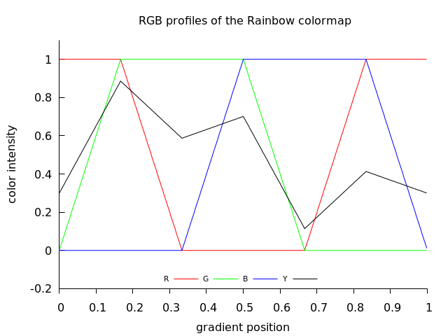  


["cyclic colormap traversing HSV color space. The map is obtained by linearly varying the hue through all possible values while keeping constant maximum saturation and value." ](https://octave.sourceforge.io/octave/function/hsv.html)

```gnuplot
set palette model HSV functions gray,1,1
```


Compare with [gnuplot image](https://commons.wikimedia.org/wiki/File:Gnuplot_HSV_gradient.png)  

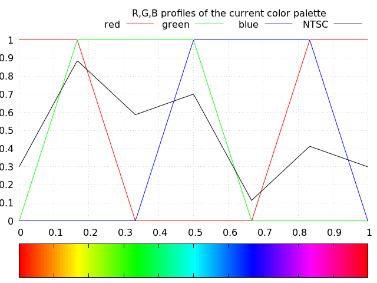  

It looks similar. sawtooth-shaped lightness profile made up of 5 ramps

Features of rainbow gradient:
* non monotone ( see black curve) 
* complex = consist of 6 monotone segments ( ramps). Graph of the lightness looks like [saw with  plain tooth pattern](https://en.wikipedia.org/wiki/Crosscut_saw) or [triangle sawtooth wave](https://en.wikipedia.org/wiki/Sawtooth_wave)

c function = GiveRainbowColor from [p.c file](./src/p.c)  


See also:
* [CIE LAB LINEAR L* RAINBOW](https://mycarta.wordpress.com/2012/12/06/the-rainbow-is-deadlong-live-the-rainbow-part-5-cie-lab-linear-l-rainbow/)
* 

## Linas colormap
")  
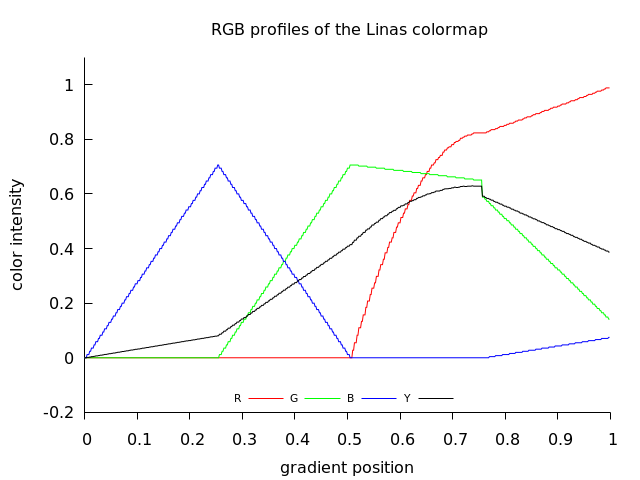  


>Your new colormap is different and ugly-ish. The line between red-and-yellow is much much worse than before.  the red-yellow discontinuity is ... confusing, annoying. .. to me, at least. Linas

Features of Linas gradient:
* non monotone ( see black curve) 
* complex = consist of 4 monotone segments
* the red-yellow discontinuity can be seen as a [jump discontinuity](https://en.wikipedia.org/wiki/Classification_of_discontinuities#Jump_discontinuity) of the green, red and black curve at gradient position 0.753333	

```txt
0.743333	 210	166	0
0.746667	 210	166	0
0.750000	 210	166	0
0.753333	 210	166	0
0.756667	 210	150	0
0.760000	 210	150	0
0.763333	 210	148	0
0.766667	 211	146	0
0.770000	 212	144	1
0.773333	 213	142	1
0.776667	 213	142	1
0.780000	 213	140	1
```

so R jumps from 166 to 150   


I have chaged it manually :  
* only 5 points = 4 linear segments
* last point ( position) changed to 1.00000

```txt
0.000000	0	0	0
0.250000	0	0	177
0.500000	0	175	0
0.750000	210	156	0
1.000000	252	36	19
```

or in the 0-1 normalized 4 columns form:  

```txt
0.000000 0.000000 0.000000 0.000000
0.250000 0.000000 0.000000 0.458823
0.500000 0.000000 0.686274 0.000000
0.750000 0.823529 0.611764 0.000000
1.000000 0.988235 0.141176 0.074509
```

which can be used by gnuplot command:   
```gnuplot
load "linas.pal"
```
and then check:  

```gnuplot
 show palette gradient
  0. gray=0.0000, (r,g,b)=(0.0000,0.0000,0.0000), #000000 =   0   0   0
  1. gray=0.2500, (r,g,b)=(0.0000,0.0000,0.4588), #000075 =   0   0 117
  2. gray=0.5000, (r,g,b)=(0.0000,0.6863,0.0000), #00af00 =   0 175   0
  3. gray=0.7500, (r,g,b)=(0.8235,0.6118,0.0000), #d29c00 = 210 156   0
  4. gray=1.0000, (r,g,b)=(0.9882,0.1412,0.0745), #fc2413 = 252  36  19
```


Now one can compute: 4 functions for each color channel ( 12 functions) using [polysolve by P. Lutus](https://arachnoid.com/polysolve/).
Result:   


")  
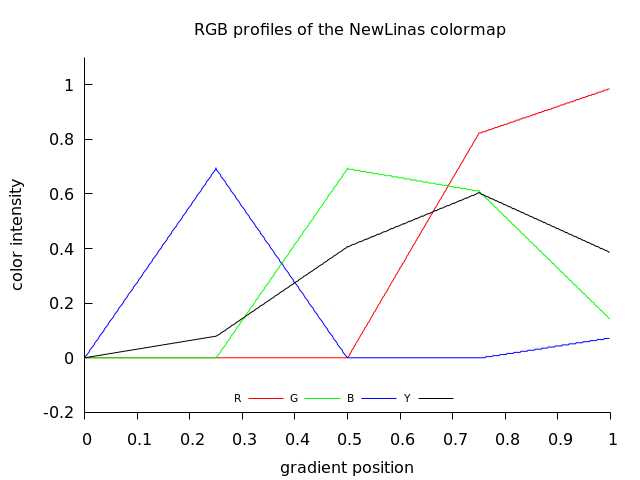  


C code for Linas gradient:
* old (= bad):  funcion GiveLinasColor from [p.c](./src/p.c)
* new (= good): function GiveLinas2Color from [p.c](./src/p.c)


Examples of use: [Linas art gallery - my version of Linas programs with old gradient](https://gitlab.com/adammajewski/LinasArtGallery_MandelbrotSet)

    
    
## Magma colormap
")  
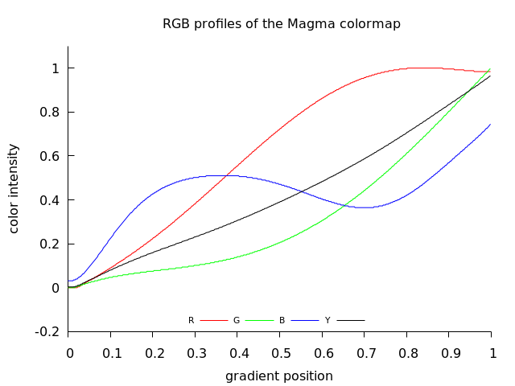    

c function = GiveMagmaColor from [p.c file](./src/p.c)  

  

## GrayL colormap
")  
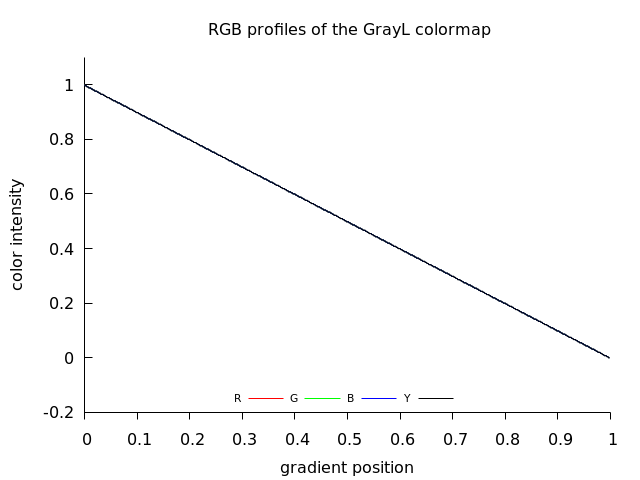    


c function = GiveGrayColorL from [p.c file](./src/p.c)  


Effect of joining gradients ( segments of the same gradeint combined):   

")  
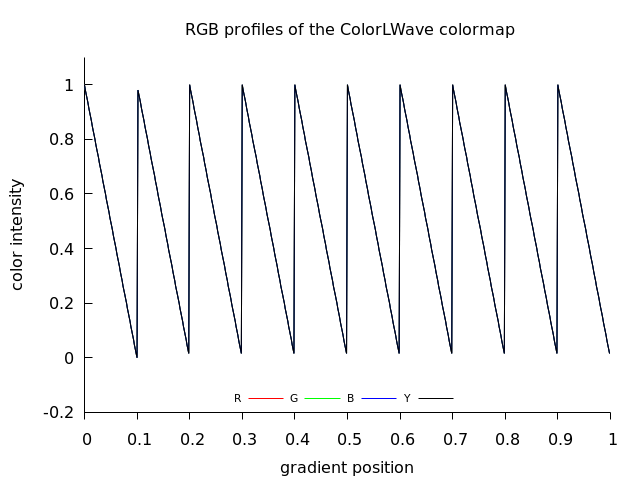    

c function = GiveGrayColorLWave from [p.c file](./src/p.c)  


Example image with use of such gradient:  

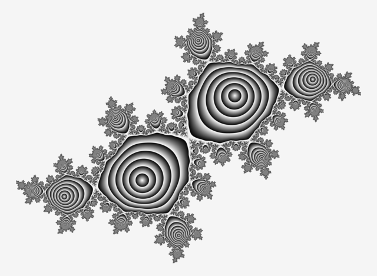  

code and description is in the [commons](https://commons.wikimedia.org/wiki/File:Quadratic_Golden_Mean_Siegel_Disc_Average_Velocity_-_Gray.png)

Effect of joining gradients ( pairs of plain and inverted gradients ):   

")  
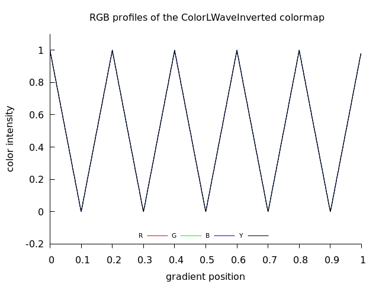    


c function = GiveGrayColorLWaveInverted from [p.c file](./src/p.c)  


see also:
* [Perception of visual information: the role of colour in seismic interpretation by  Barbara Froner, Stephen J. Purves, James Lowell  and Jonathan Henderson](https://pdfs.semanticscholar.org/31fc/111a17fc859750a664b0f4be5b60890b427d.pdf)
* [an exponential grayscale cmap by Matteo Niccoli](https://github.com/mycarta/Reproducing-exponential-grayscale-cmap)
* [sigmoid grayscale colormaps](https://github.com/mycarta/Sigmoid_app)
## GrayNL2 colormap
"")  
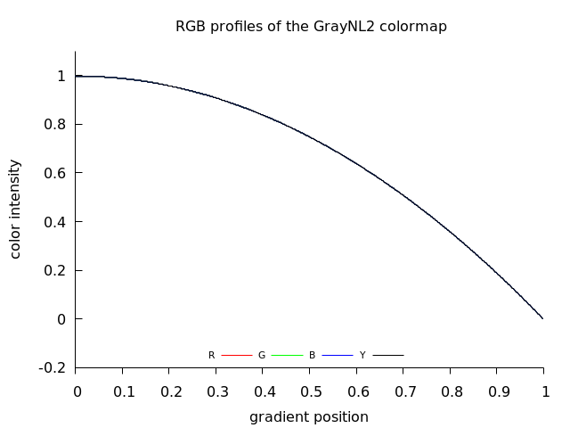  

c function = GiveGrayColorNL2 from [p.c file](./src/p.c)  

## GrayNL3 colormap
")  
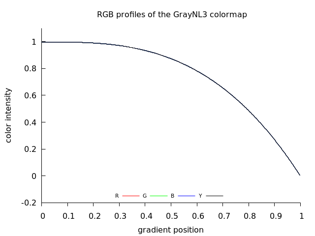  

c function = GiveGrayColorNL3 from [p.c file](./src/p.c  

Gradient can be inverted and joined ( both inverted and not inverted part create one wave):  

 GrayNL3 gradient ( colormap)")  
 GrayNL3 colormap")  

c function :
* GiveGrayColorNL3Wave2 from [p.c file](./src/p.c)
* GiveGrayColorNL3Wave10 from [p.c file](./src/p.c) 


 GrayNL3 gradient ( colormap)")  
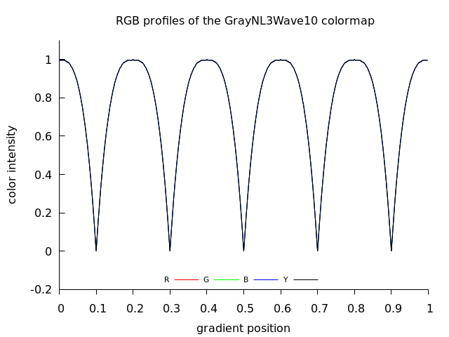  


Not inverted:

 GrayNL3 not invertedgradient ( colormap)")  
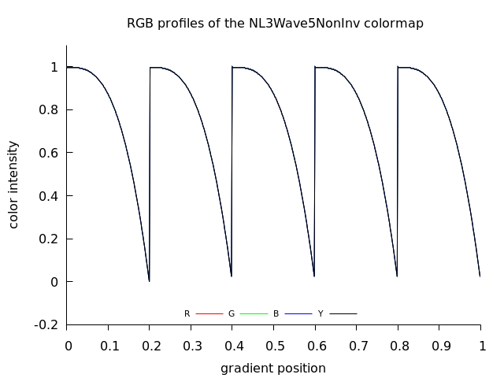  


c function = GiveGrayColorNL3Wave5NonInv from [p.c file](./src/p.c)  
## GrayGamma 
Nonlinear gamma-corrected black and white palette

")  
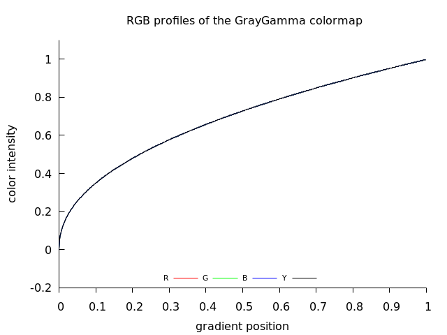  


It is from gnuplot:
```gnuplot
gamma = 2.2
color(gray) = gray**(1./gamma)
set palette model RGB functions color(gray), color(gray), color(gray) # A gamma-corrected black and white palette

```

c function = GiveGrayGammaColor from [p.c file](./src/p.c)  

## GraySqrt colormap
")  
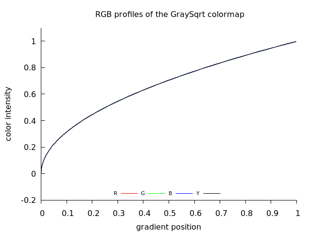  

c function = GiveGrayColorSqrt from [p.c file](./src/p.c)  


Gradient can be inverted and joined:  

 GraySqrt gradient ( colormap)")  
 GraySqrt colormap")  

c function = GiveGrayColorSqrtWave from [p.c file](./src/p.c)  


## Green colormap
")  
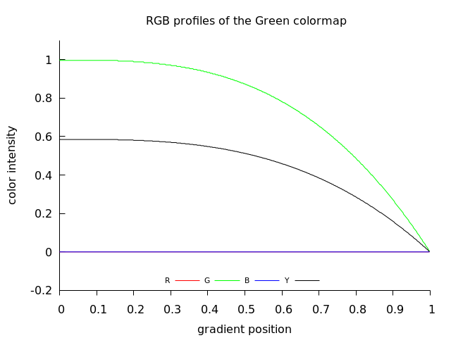  


c function = GiveColorGreen from [p.c file](./src/p.c)  

")  

More is here:
* [commons](https://commons.wikimedia.org/wiki/File:Julia_set_for_f(z)_%3D_z%5E2%2B0.355534_-0.337292*i.png)
* [gitlab](https://gitlab.com/adammajewski/pfm_c)


##  Smooth CoolWarm diverging colormap 
")  
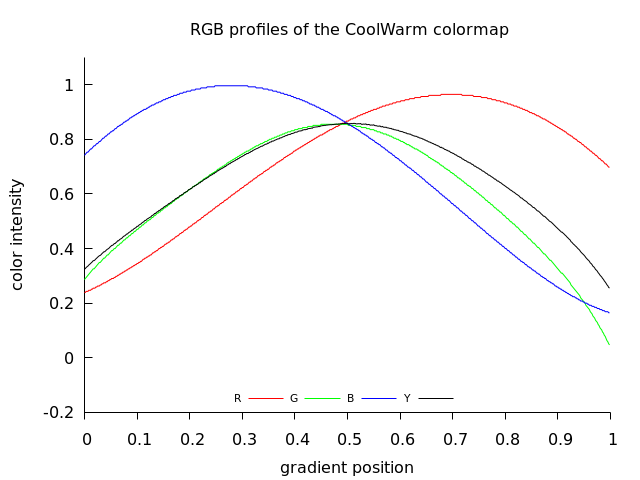  

Description by [Kenneth Moreland ](http://www.kennethmoreland.com/color-advice/)  
* blue-red diverging 
* It is a diverging (double-ended) color map with a smooth transition in the middle to prevent artifacts at the midpoint


code:  
* funcion GiveColorCoolWarm from [p.c](./src/p.c)
* [diverging_map_gnuplot.pal](diverging_map_gnuplot.pal) - gnuplot palette file


# Notation
* [(color) gradient](https://en.wikipedia.org/wiki/Color_gradient) = colormap 
* A gradient is a set of colors arranged in a linear order
* palette 
* A colour map is a path through colour	space	

# gradient forms
* numbers aproximating transfer function
* function ( [transfer functions](https://en.wikibooks.org/wiki/Color_Theory/Color_gradient#Transfer_function)) 
* image

## numbers aproximating transfer function
* array of 3 values ( RGB)
  * [LUT](https://en.wikipedia.org/wiki/Lookup_table) 
* file with data ( 3 columns) in various formats: txt, cvs and [many others](http://soliton.vm.bytemark.co.uk/pub/cpt-city/notes/formats.html) used by [graphic software](http://soliton.vm.bytemark.co.uk/pub/cpt-city/notes/software.html)
  * [cpt-city](http://soliton.vm.bytemark.co.uk/pub/cpt-city/) 
  * [Fracting .map files)](http://www.krajzewicz.de/blog/free-color-palettes.php)
  * [automatic-color-palette-creation - Softology's Blog](https://softologyblog.wordpress.com/2019/03/23/automatic-color-palette-creation/)
  * [colorzilla](https://www.colorzilla.com/firefox/palettes.html)
  * gnuplot 
    * pal files
    * [formule](http://gnuplot.sourceforge.net/demo/pm3dcolors.html)
    
  * [cran](http://cran.fhcrc.org/web/packages/pals/vignettes/pals_examples.html)
  * [gencolormap](https://marlam.de/gencolormap/)
  * [matplotlib](https://matplotlib.org/3.1.0/gallery/color/colormap_reference.html)
* css file
  * [gradient editor from colorzilla](https://www.colorzilla.com/gradient-editor/)
* list of numbers in the binary parameter file


## function ( 3 transfer functions) = colour map 

## image
* stripe of colors ( ramp)
* diagram of the function
* CLUT image file
  * [imagemagic](https://imagemagick.org/script/command-line-options.php#clut): image is ordinarily a gradient image containing the histogram mapping of how each channel should be modified. Typically it is a either a single row or column image of replacement color values. If larger than a single row or column, values are taken from a diagonal line from top-left to bottom-right corners.
  * [gimp](https://docs.gimp.org/2.10/en/plug-in-gradmap.html)
  * [gmic](https://gmic.eu/color_presets/index.shtml)
  * [darktable](https://www.darktable.org/2019/05/New%20module-lut3d/)

# Features of colormaps:
* discrete/continous
* dimension: 1D / 2D
  * mesh gradient ( 2D used in SVG)
* number of the gradient segments
* direction ( increasing/decreasing)
* monotonicy of the lightness 
* cyclic / non-cyclic
* precision
  * type and a range of the numbers:  unsigned char and [0 ; 255] or  double and [0.0 ; 1.0 ]
  * length of the numbers array ( proportional to precision of nonlinear function approximation. for linear function 2 points are enough)
  * function of color channel and the gradient segment: linear / nonlinear ( related what function is used for the interpolation between nodes)
* perceptual uniformity means that all pairs of adjacent colors will look equally different from each other 
* [Colour-vision-deficiency (CVD) friendly](http://www.fabiocrameri.ch/resources/%2BREADME_ScientificColourmaps.pdf)


# Taxonomy of color gradients

[Taxonomy of Colour Maps by Peter Kovesi](http://arxiv.org/abs/1509.03700)


Taxonomy of contious colour maps according to the lightness:
* [monotone ( monotonic)](https://en.wikipedia.org/wiki/Monotonic_function) with monotonic brightness = strictly monotonic lightness
  * linear  = have colour lightness values that increase or decrease linearly over the colour map's range. Are intended for general use and have colour lightness values that increase or decrease linearly over the colour map's range
  * nonlinear
* isoluminant:  constant lightness and low contrast colour maps can be useful when displaying data with [relief shading](https://en.wikipedia.org/wiki/Terrain_cartography#Shaded_relief)
* non monotone 
  * multisegment
    * 2 segments
      * diverging = ratio, bipolar or double-ended color maps = [a map containing colors with different hues at each end and meeting with a bright neutral color in the middle. Diverging color maps are traditionally designed for displaying scalars that have a value of special significance in the middle (such as sea level for elevation or the freezing point for temperature).](http://www.kennethmoreland.com/color-advice/BadColorMaps.pdf)
      * 4 segments:   Linas
      * 6 segments:  rainbow : should not be used in scientific computing
    * cyclic 
      * [wave colormaps](https://sciviscolor.org/wave-colormaps/)
  
Names:   
* [Perceptually Uniform Colour Maps](https://peterkovesi.com/projects/colourmaps/) = uniform perceptual contrast over their whole range
* [perceptual colormap](https://github.com/mycarta/rainbowbot) = ordered, strictly monotonic lightness
  * [cubehelix](https://ifweassume.blogspot.com/2013/05/cubehelix-or-how-i-learned-to-love.html)
* [qualitative, sequential, and diverging](http://colorspace.r-forge.r-project.org/articles/hcl_palettes.html#qualitative-palettes)
* [A good discrete palette has distinct colors. A good continuous colormap does not show boundaries between colors.](https://cran.r-project.org/web/packages/pals/vignettes/pals_examples.html)
* [ Categorical data can also be represented as numbers, but each number is then distinct, with the numerical value important only to distinguish from other values. When categorical data is plotted as colors, each category should have a color visibly distinct from all the other colors, not nearby in color space, to make each category separately visible.](https://colorcet.holoviz.org/user_guide/Categorical.html)

# Conversion between gradient types

## How to convert data to the function ( how to fit curve to the data)?
* Polynomial Regression 
  * [polysolve by Paul Lutus](https://arachnoid.com/polysolve/)- online tool which gives a c function as an output ( click on the output form button to cycle through the available output forms)
  * [simplest_regression.py](./src/simplest_regression.py) - python program (Polynomial solver) by Paul Lutus

Tools:
* gedit : replace "," with \t 
* LibreOffice Calc ( opens cvs files, choose columns, remove columns)), see [note about importing scv files for polish settings by Mirosław Zalewski](http://przepis-na-lo.pl/2013/05/poprawne-rozpoznawanie-liczb-skopiowanych-z-internetu/)

## How to convert between gradient files?
* [cptutils by JJ Green](http://soliton.vm.bytemark.co.uk/pub/jjg/en/code/cptutils/)
  * [online](http://soliton.vm.bytemark.co.uk/pub/cptutils-online/select.html)
  * [git](https://gitlab.com/jjg/cptutils)
* [PaletteTool by Daniel Krajzewicz](http://www.krajzewicz.de/palettetool/index.php)


# How to create a gradient?
## continous
* [The Colour Map Design Process by Peter Kovesi](https://peterkovesi.com/papers/ColourMapsForColourBlindIAMG2017.pdf)
* [Good Colour Maps: How to Design Them by Peter Kovesi ( arxiv)](https://arxiv.org/pdf/1509.03700v1.pdf)
* [Good Colour Maps: How to Design Them by Peter Kovesi (page)](https://www.groundai.com/project/good-colour-maps-how-to-design-them/1)
* [cosine procedural palete by Inigo Quilez](http://www.iquilezles.org/www/articles/palettes/palettes.htm): "Mine cosine based palette generator is mostly designed for small demos where the size of the code matters, but otherwise it's not very powerful nor expressive."

## discrete
* [Colour displays for categorical images by  Glasbey et al. (2007)](https://strathprints.strath.ac.uk/30312/1/colorpaper_2006.pdf)

# Lightness
* [How to Determine Lightness by Reda Lemeden](https://thoughtbot.com/blog/closer-look-color-lightness#how-to-determine-lightness)
* [stackoverflow question: formula-to-determine-brightness-of-rgb-color](https://stackoverflow.com/questions/596216/formula-to-determine-brightness-of-rgb-color)
* desaturation = Converting color to [grayscale](https://en.wikipedia.org/wiki/Grayscale)
  * [Three algorithms for converting color to grayscale by John D. Cook](https://www.johndcook.com/blog/2009/08/24/algorithms-convert-color-grayscale/)          
  * [gimp 2.6 doc](https://docs.gimp.org/2.6/en/gimp-tool-desaturate.html)
  * [stackoverflow question : Standard-rgb-to-grayscale-conversion](https://stackoverflow.com/questions/17615963/standard-rgb-to-grayscale-conversion)
  * [Conversion to grayscale by Jason Summers](https://entropymine.com/imageworsener/grayscale/)

[Relative luminance is formed as a weighted sum of linear RGB components](https://en.wikipedia.org/wiki/Luma_(video))


```c
//from function test_palette_subcommand from the file gnuplot/src/command.c
ntsc = 0.299 * rgb.r + 0.587 * rgb.g + 0.114 * rgb.b;
```


## Cielab lightness
* RGB -> XYZ -> Celab
  * [easyrgb](http://www.easyrgb.com/en/math.php#text2)
  * in OpenCV source /src/cv/cvcolor.cpp there are functions for color space conversions: [icvBGRx2Lab_32f_CnC3R](https://github.com/cybertk/opencv/blob/master/opencv/cv/src/cvcolor.cpp)
  * [python code by Manoj Pandey](https://gist.github.com/manojpandey/f5ece715132c572c80421febebaf66ae)


# files
## programs
* [p.c](./src/p.c) - c program which creates 60n.png files and n.txt files 
* [plot.gp](./src/plot.gp) - gnuplot program which converts n.png fils from n.txt files
## palettes
* [diverging_map_gnuplot.pal](diverging_map_gnuplot.pal) 


# Links

## colourmap tests
* tests
  * [pal.test from the ‘pals’ package by Kevin Wright](https://cran.r-project.org/web/packages/pals/vignettes/pals_examples.html)
  * [colormap inxpections from ethplot](https://github.com/liamedeiros/ehtplot/blob/docs/docs/COLORMAPS.ipynb)
  * [How to evaluate and compare colormaps by Matteo Niccoli, MyCarta](https://github.com/seg/tutorials-2014/blob/master/1408_Evaluate_and_compare_colormaps/How_to_evaluate_and_compare_colormaps.ipynb)
  
* test image
  * [CET Perceptually Uniform Colour Maps: The Test Image by Peter Kovesi:A sine wave superimposed on a ramp](https://peterkovesi.com/projects/colourmaps/colourmaptestimage.html)
  * [Colormap Test Image by Steve Eddins, July 24, 2017](https://blogs.mathworks.com/steve/2017/07/24/colormap-test-image/?s_tid=blogs_rc_2)
  * [ Campbell-Robson Contrast Sensitivity Chart](https://kwstat.github.io/pals/articles/pals_examples.html)
  * [pals test image](https://kwstat.github.io/pals/)
* 3D plot
  * [a three-dimensional scatterplot in the LUV space](https://kwstat.github.io/pals/articles/pals_examples.html)
  * [3-D visualisation (made with Maple) of how the colour scheme spirals around the diagonal of the colour cube](http://www.mrao.cam.ac.uk/~dag/CUBEHELIX/#Other)
  * [display the colorbar in Lab space in a 3D view](https://mycarta.wordpress.com/2012/12/21/comparing-color-palettes/)
## gnuplot
* [gnuplot demo script: pm3dcolors.dem](http://gnuplot.sourceforge.net/demo/pm3dcolors.html)
* [gnuplot palletes](https://github.com/Gnuplotting/gnuplot-palettes)

## Imagemagic
* [color gradient](https://imagemagick.org/script/gradient.php)

## python colormaps
* [Palettable = Color palettes for Python by Matt Davis](https://jiffyclub.github.io/palettable/)
* [A full implementation of Dave Green's "cubehelix" colormap for Python by James Davenport](https://github.com/jradavenport/cubehelix)
* [python colormaps](http://www-personal.umich.edu/~mejn/computational-physics/colormaps.py)
* [paraview](https://gitlab.kitware.com/paraview/paraview/blob/master/Wrapping%2FPython%2Fparaview%2F_colorMaps.py)
* [Berkeley Institute for Data Science colormaps](https://github.com/BIDS/colormap/blob/master/colormaps.py)
* [scivis color](https://sciviscolor.org/resources/)

## css gradients
* [Program do generowania gradientów w formacie Gimpa, css i Inkscape-a](https://www.obliczeniowo.com.pl/156)

## Octave/matlab
* [Origins of Colormaps Posted by Cleve Moler, February 2, 2015](https://blogs.mathworks.com/cleve/2015/02/02/origins-of-colormaps/)


## R
* [pals by Kevin Wright](https://kwstat.github.io/pals/)
* [cetcolor by James Balamuta and Peter Kovesi](https://github.com/coatless/cetcolor)
* [r-color-palettes](https://github.com/EmilHvitfeldt/r-color-palettes)

## People
* [Peter Kovesi](https://www.peterkovesi.com/)
  * [Perceptually Uniform Colour Maps](https://peterkovesi.com/projects/colourmaps/)
  * [matlab functions](https://www.peterkovesi.com/matlabfns/index.html#colour)
* [Jim J  Green](http://soliton.vm.bytemark.co.uk/pub/jjg/en/)
* [Kenneth Moreland](http://www.kennethmoreland.com/)
  * [BadColorMaps](http://www.kennethmoreland.com/color-advice/BadColorMaps.pdf)
  * [Diverging Color Maps for Scientific Visualization](http://www.kennethmoreland.com/color-maps/)
* [Colin Ware](https://ccom.unh.edu/vislab/colin_ware.html)
* [Fabio Crameri](http://www.fabiocrameri.ch/colourmaps.php)
* [Dave Green](http://www.mrao.cam.ac.uk/~dag/CUBEHELIX/#Other)
## www
* [khan academy:  color science by Pixar](https://www.khanacademy.org/partner-content/pixar/color)


## mesh gradients
* [svg](https://graphicdesign.stackexchange.com/questions/105403/svg-gradient-implementation)
* [svg](http://libregraphicsworld.org/blog/entry/gradient-meshes-and-hatching-to-be-removed-from-svg-2-0)
* [haskell](https://twinside.github.io/coon_rendering.html)
* [imscape](https://wiki.inkscape.org/wiki/index.php/Mesh_Gradients)
  * [experiment](http://www.chrishilbig.com/mesh-gradients/)
  * [creating](http://write.flossmanuals.net/start-with-inkscape/creating-a-mesh-gradient/)
* [SVG Mesh Polyfill in js by Tavmjong Bah](http://tavmjong.free.fr/SVG/POLYFILL/MESH/mesh.html)
  * [gitlab](https://gitlab.com/Tavmjong/mesh.js)
  * [blog](http://tavmjong.free.fr/blog/?p=1554)


Formats: .sketch, .png, .ai, .jpg, .eps

Interpolation:
* linear 


# Motivation

Show how to implement color gradient in your program ( C)


## Contributors

are wellcome 


  
## License

[GPL](https://www.gnu.org/licenses/gpl-3.0.html)


# technical notes
GitLab uses:
* the Redcarpet Ruby library for [Markdown processing](https://gitlab.com/gitlab-org/gitlab-foss/blob/master/doc/user/markdown.md)
* KaTeX to render [math written with the LaTeX syntax](https://gitlab.com/gitlab-org/gitlab-foss/blob/master/doc/user/markdown.md), but [only subset](https://khan.github.io/KaTeX/function-support.html)

## API Reference

simple one file c programs which 
- do not need any extra libraries 
- can be run from console
- compiled with gcc 
- multiplatform

How to compile and run is described in the comments of c files


## Git


```git
cd existing_folder
git init
git remote add origin git@gitlab.com:adammajewski/color_gradient.git
git add .
git commit -m "Initial commit"
git push -u origin master
```


```
  git clone git@gitlab.com:adammajewski/color_gradient.git
```

Subdirectory

```git
mkdir images
git add *.png
git mv  *.png ./images
git commit -m "move"
git push -u origin master
```
then link the images:

```txt
 
```


local repo : ~/c/varia/color/gradient

