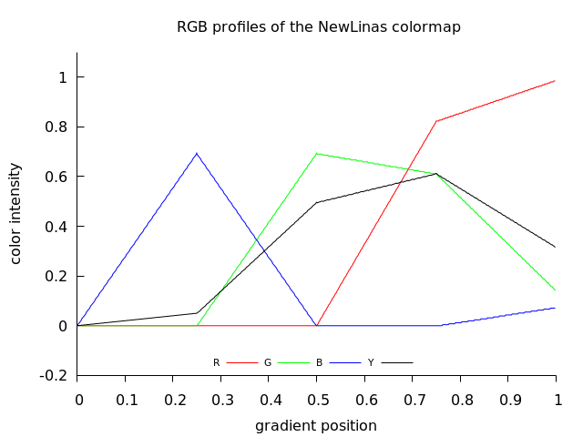

What should and what should not do coloromap in scintific visualisation?
* should highlight features of the data
* should not highlight features that are not in the data but only in the gradient itself
  * ["Many colour maps provided by vendors have highly uneven perceptual contrast over their range. Colour maps may have points of locally high colour contrast leading to the perception of false anomalies in your data when there is none. Conversely colour maps may also have 'flat spots' of low perceptual contrast that prevent you from seeing features in the data."](https://peterkovesi.com/projects/colourmaps/)
  * ["both obfuscate the data with artifacts that are not in the data and hide important features that are in the data"](http://www.kennethmoreland.com/color-advice/BadColorMaps.pdf) 


Notation
* (color) gradient = colormap = palette


# gradient forms
* numbers aproximating transfer function
* function ( transfer functions) 
* image

## numbers aproximating transfer function
* array of 3 values ( RGB)
  * [LUT](https://en.wikipedia.org/wiki/Lookup_table) 
* csv or text file with data ( 3 columns)
  * [Fracting .map files)](http://www.krajzewicz.de/blog/free-color-palettes.php)
  * [automatic-color-palette-creation - Softology's Blog](https://softologyblog.wordpress.com/2019/03/23/automatic-color-palette-creation/)
  * [colorzilla](https://www.colorzilla.com/firefox/palettes.html)
  * gnuplot pal files
  * [cran](http://cran.fhcrc.org/web/packages/pals/vignettes/pals_examples.html)
  * [gencolormap](https://marlam.de/gencolormap/)
* css file
  * [gradient editor from colorzilla](https://www.colorzilla.com/gradient-editor/)
* list of numbers in the binary parameter file


## function ( 3 transfer functions) = colour map 

## image
* stripe of colors
* diagram of the function
* CLUT image file
  * [imagemagic](https://imagemagick.org/script/command-line-options.php#clut): image is ordinarily a gradient image containing the histogram mapping of how each channel should be modified. Typically it is a either a single row or column image of replacement color values. If larger than a single row or column, values are taken from a diagonal line from top-left to bottom-right corners.
  * [gimp](https://docs.gimp.org/2.10/en/plug-in-gradmap.html)
  * [gmic](https://gmic.eu/color_presets/index.shtml)
  * [darktable](https://www.darktable.org/2019/05/New%20module-lut3d/)

# Features of colormaps:
* number of the gradient segments
* monotonicy of the lightness 
* function of color channel and the gradient segment: linear / nonlinear
* cyclic / non-cyclic
* type and a range of the numbers: 
  * unsigned char and [0 ; 255]
  * double and [0.0 ; 1.0 ]
* length of the numbers array ( proportional to precision of nonlinear function approximation. for linear function 2 points are enough)
* perceptual uniformity means that all pairs of adjacent colors will look equally different from each other 


# Taxonomy of color gradients


[Taxonomy of Colour Maps by Peter Kovesi](http://arxiv.org/abs/1509.03700)


Taxonomy of Colour Maps according to the lightness:
* [monotone ( monotonic)](https://en.wikipedia.org/wiki/Monotonic_function) with monotonic brightness
  * linear  = have colour lightness values that increase or decrease linearly over the colour map's range. Are intended for general use and have colour lightness values that increase or decrease linearly over the colour map's range
  * nonlinear
* isoluminant:  constant lightness and low contrast colour maps can be useful when displaying data with [relief shading](https://en.wikipedia.org/wiki/Terrain_cartography#Shaded_relief)
* non monotone 
  * multisegment
    * 2 segments
      * diverging = ratio, bipolar or double-ended color maps = [a map containing colors with different hues at each end and meeting with a bright neutral color in the middle. Diverging color maps are traditionally designed for displaying scalars that have a value of special significance in the middle (such as sea level for elevation or the freezing point for temperature).](http://www.kennethmoreland.com/color-advice/BadColorMaps.pdf)
      * 4 segments:   Linas
      * 6 segments:  rainbow : should not be used in scientific computing
    * cyclic 
      * [wave colormaps](https://sciviscolor.org/wave-colormaps/)
  
   
  
# Examples
* Rainbow = 0
* Linas = 1
* Magma = 2
* GrayL = 3
* GrayNL2 = 4
* GrayNL3 = 5
* GraySqrt = 6
* Green = 7
* Linas2 = 8

## Rainbow colormap
")  
  

Compare with [gnuplot file](https://commons.wikimedia.org/wiki/File:Gnuplot_HSV_gradient.png)  

  

It looks similar.

Features of rainbow gradient:
* non monotone ( see black curve) 
* complex = consist of 6 monotone segments

c function = GiveRainbowColor from p.c file

## Linas colormap
")  
  


>Your new colormap is different and ugly-ish. The line between red-and-yellow is much much worse than before.  the red-yellow discontinuity is ... confusing, annoying. .. to me, at least. Linas

Features of Linas gradient:
* non monotone ( see black curve) 
* complex = consist of 4 monotone segments
* the red-yellow discontinuity can be seen as a [jump discontinuity](https://en.wikipedia.org/wiki/Classification_of_discontinuities#Jump_discontinuity) of black curve at gradient position 0.753333	

```txt
0.743333	 210	166	0
0.746667	 210	166	0
0.750000	 210	166	0
0.753333	 210	166	0
0.756667	 210	150	0
0.760000	 210	150	0
0.763333	 210	148	0
0.766667	 211	146	0
0.770000	 212	144	1
0.773333	 213	142	1
0.776667	 213	142	1
0.780000	 213	140	1
```

so R jumps from 166 to 150 


I have chaged it manually :
* only 5 points = 4 linear segments
* last point ( position) changed to 1.00000

```txt
0.000000	0	0	0
0.250000	0	0	177
0.500000	0	175	0
0.750000	210	156	0
1.000000	252	36	19
```

Now one can compute: 4 functions for each color channel ( 12 functions) using [polysolve by P. Lutus](https://arachnoid.com/polysolve/).
Result:   


")  
  


C code for Linas gradient:
* old (= bad):  funcion GiveLinasColor from p.c
* new (= good): function GiveLinas2Color 


Examples of use: [Linas art gallery - my version of Linas programs with old gradient](https://gitlab.com/adammajewski/LinasArtGallery_MandelbrotSet)

    
    
## Magma colormap
")  
    
  

## GrayL colormap
")  
    

## GrayNL2 colormap
")  
  

## GrayNL3 colormap
")  
  

## GraySqrt colormap
")  
  

## Green colormap

  


")  

More is here:
* [commons](https://commons.wikimedia.org/wiki/File:Julia_set_for_f(z)_%3D_z%5E2%2B0.355534_-0.337292*i.png)
* [gitlab](https://gitlab.com/adammajewski/pfm_c)

# Conversion between gradient types

## How to convert data to the function ( how to fit curve to the data)?
* Polynomial Regression 
  * [polysolve by P. Lutus](https://arachnoid.com/polysolve/)- online tool


## Lightness
* [How to Determine Lightness by Reda Lemeden](https://thoughtbot.com/blog/closer-look-color-lightness#how-to-determine-lightness)
* [stackoverflow question: formula-to-determine-brightness-of-rgb-color](https://stackoverflow.com/questions/596216/formula-to-determine-brightness-of-rgb-color)


[Relative luminance is formed as a weighted sum of linear RGB components](https://en.wikipedia.org/wiki/Luma_(video))

$`Y = 0.2126 R + 0.7152 G + 0.0722 B`$


### Cielab lightness
* RGB -> XYZ -> Celab
  * [easyrgb](http://www.easyrgb.com/en/math.php#text2)
  * in OpenCV source /src/cv/cvcolor.cpp there are functions for color space conversions: [icvBGRx2Lab_32f_CnC3R](https://github.com/cybertk/opencv/blob/master/opencv/cv/src/cvcolor.cpp)
  * [python code by Manoj Pandey](https://gist.github.com/manojpandey/f5ece715132c572c80421febebaf66ae)


# Links

## gnuplot
* [gnuplot demo script: pm3dcolors.dem](http://gnuplot.sourceforge.net/demo/pm3dcolors.html)
* [gnuplot palletes](https://github.com/Gnuplotting/gnuplot-palettes)

## Imagemagic
* [color gradient](https://imagemagick.org/script/gradient.php)

## python colormaps
* [python colormaps](http://www-personal.umich.edu/~mejn/computational-physics/colormaps.py)
* [paraview](https://gitlab.kitware.com/paraview/paraview/blob/master/Wrapping%2FPython%2Fparaview%2F_colorMaps.py)
* [Berkeley Institute for Data Science colormaps](https://github.com/BIDS/colormap/blob/master/colormaps.py)
* [scivis color](https://sciviscolor.org/resources/)

## People
* [Kenneth Moreland](http://www.kennethmoreland.com/)
  * [BadColorMaps](http://www.kennethmoreland.com/color-advice/BadColorMaps.pdf)
  * [Diverging Color Maps for Scientific Visualization](http://www.kennethmoreland.com/color-maps/)
* [Colin Ware](https://ccom.unh.edu/vislab/colin_ware.html)
* [Peter Kovesi](https://www.peterkovesi.com/)
  * [Perceptually Uniform Colour Maps](https://peterkovesi.com/projects/colourmaps/)
  * [matlab functions](https://www.peterkovesi.com/matlabfns/index.html#colour)
## www
* [khan academy:  color science by Pixar](https://www.khanacademy.org/partner-content/pixar/color)


# Motivation

Show how to implement color gradient in your program ( C)


## Contributors

are wellcome 


  
## License

A short snippet describing the license (MIT, Apache, etc.)


# technical notes
GitLab uses:
* the Redcarpet Ruby library for [Markdown processing](https://gitlab.com/gitlab-org/gitlab-foss/blob/master/doc/user/markdown.md)
* KaTeX to render [math written with the LaTeX syntax](https://gitlab.com/gitlab-org/gitlab-foss/blob/master/doc/user/markdown.md), but [only subset](https://khan.github.io/KaTeX/function-support.html)

## API Reference

simple one file c programs which 
- do not need any extra libraries 
- can be run from console
- compiled with gcc 
- multiplatform

How to compile and run is described in the comments of c files


## Git


```git
cd existing_folder
git init
git remote add origin git@gitlab.com:adammajewski/color_gradient.git
git add .
git commit -m "Initial commit"
git push -u origin master
```


```
  git clone git@gitlab.com:adammajewski/color_gradient.git
```


local repo : ~/c/varia/color/gradient

