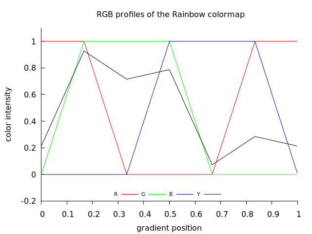
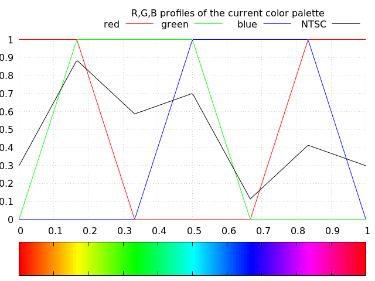
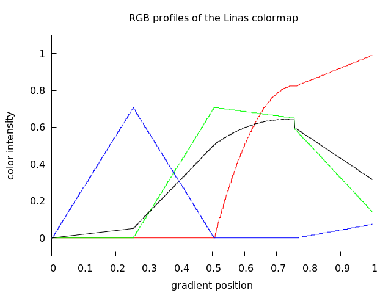
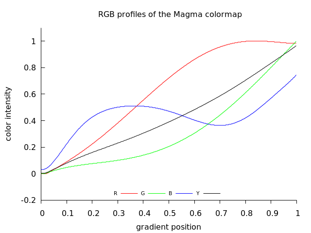
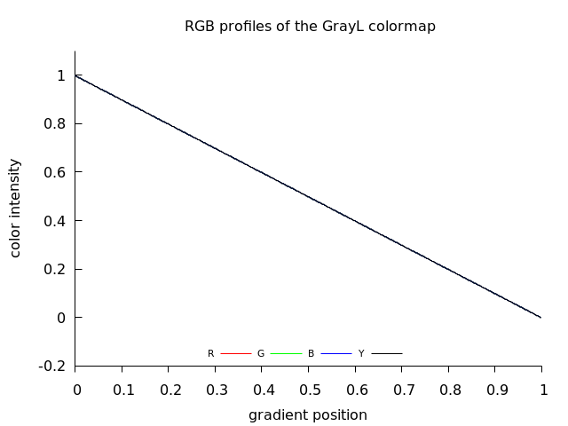
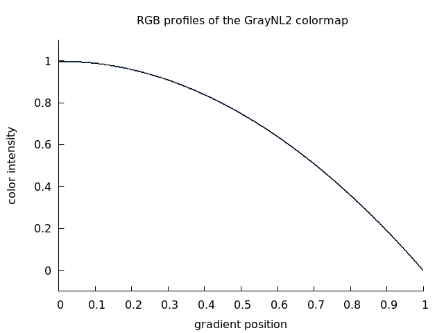
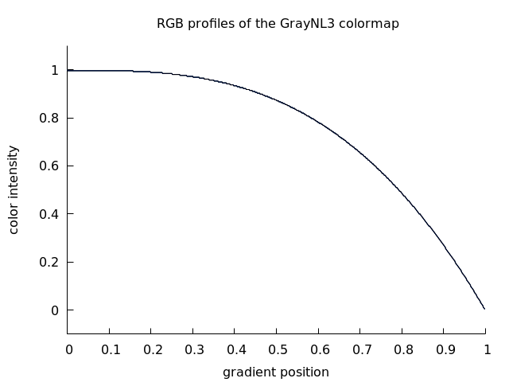
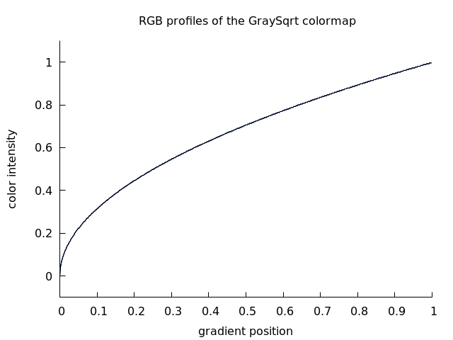
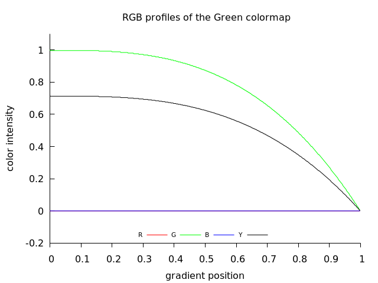

# gradient forms:
* table
  * array of 3 values ( RGB)
* function ( 3 transfer functions) = colour map 
* image
  * stripe of colors
  * diagram of the function
  * CLUT image file
    * [imagemagic](https://imagemagick.org/script/command-line-options.php#clut): image is ordinarily a gradient image containing the histogram mapping of how each channel should be modified. Typically it is a either a single row or column image of replacement color values. If larger than a single row or column, values are taken from a diagonal line from top-left to bottom-right corners.
    * [gimp](https://docs.gimp.org/2.10/en/plug-in-gradmap.html)
    * [gmic](https://gmic.eu/color_presets/index.shtml)
    * [darktable](https://www.darktable.org/2019/05/New%20module-lut3d/)


What should and what should not do colrmap in scintific visualisation
* ["Many colour maps provided by vendors have highly uneven perceptual contrast over their range. Colour maps may have points of locally high colour contrast leading to the perception of false anomalies in your data when there is none. Conversely colour maps may also have 'flat spots' of low perceptual contrast that prevent you from seeing features in the data."](https://peterkovesi.com/projects/colourmaps/)
* ["both obfuscate the data with artifacts that are not in the data and hide important features that are in the data"](http://www.kennethmoreland.com/color-advice/BadColorMaps.pdf) 


# Taxonomy of color gradients


[Taxonomy of Colour Maps by Peter Kovesi](http://arxiv.org/abs/1509.03700)
* linear : are intended for general use and have colour lightness values that increase or decrease linearly over the colour map's range
* diverging = ratio, bipolar or double-ended color maps 
* rainbow
* cyclic
* isoluminant : constant lightness and low contrast colour maps can be useful when displaying data with [relief shading](https://en.wikipedia.org/wiki/Terrain_cartography#Shaded_relief)


Taxonomy of Colour Maps according to brightness
* simple 
  * [monotone ( monotonic)](https://en.wikipedia.org/wiki/Monotonic_function) with monotonic brightness
    * linear  = have colour lightness values that increase or decrease linearly over the colour map's range
    * nonlinear
  * isoluminant
  * non monotone 
    * diverging = [is a double-ended map containing colors with different hues at each end and meeting with a bright neutral color in the middle. Diverging color maps are traditionally designed for displaying scalars that have a value of special significance in the middle (such as sea level for elevation or the freezing point for temperature).](http://www.kennethmoreland.com/color-advice/BadColorMaps.pdf)
    * rainbow = should not be used in scientific visualisation
* complex
  * cyclic
  
  
# Examples
* Rainbow = 0
* Linas = 1
* Magma = 2
* GrayL = 3
* GrayNL2 = 4
* GrayNL3 = 5
* GraySqrt = 6
* Green = 7

## Rainbow colormap
")  
  

Compare with [gnuplot file](https://commons.wikimedia.org/wiki/File:Gnuplot_HSV_gradient.png)  

  

It looks similar.

Features of rainbow gradient:
* non monotone ( see black curve) 
* complex = consist of 6 monotone segments


  
## Linas colormap
")  
  


Examples of use: [Linas art gallery - my version of Linas programs](https://gitlab.com/adammajewski/LinasArtGallery_MandelbrotSet)

    
    
## Magma colormap
")  
    
  

## GrayL colormap
")  
    

## GrayNL2 colormap
")  
  

## GrayNL3 colormap
")  
  

## GraySqrt colormap
")  
  

## Green colormap
")  
  

# Links

## gnuplot
* [gnuplot demo script: pm3dcolors.dem](http://gnuplot.sourceforge.net/demo/pm3dcolors.html)
* [gnuplot palletes](https://github.com/Gnuplotting/gnuplot-palettes)

## Imagemagic
* [color gradient](https://imagemagick.org/script/gradient.php)

## python colormaps
* [python colormaps](http://www-personal.umich.edu/~mejn/computational-physics/colormaps.py)
* [paraview](https://gitlab.kitware.com/paraview/paraview/blob/master/Wrapping%2FPython%2Fparaview%2F_colorMaps.py)
* [Berkeley Institute for Data Science colormaps](https://github.com/BIDS/colormap/blob/master/colormaps.py)
* [scivis color](https://sciviscolor.org/resources/)

## People
* [Kenneth Moreland](http://www.kennethmoreland.com/)
  * [BadColorMaps](http://www.kennethmoreland.com/color-advice/BadColorMaps.pdf)
  * [Diverging Color Maps for Scientific Visualization](http://www.kennethmoreland.com/color-maps/)
* [Colin Ware](https://ccom.unh.edu/vislab/colin_ware.html)
* [Peter Kovesi](https://www.peterkovesi.com/)
  * [Perceptually Uniform Colour Maps](https://peterkovesi.com/projects/colourmaps/)
  * [matlab functions](https://www.peterkovesi.com/matlabfns/index.html#colour)
## www
* [khan academy:  color science by Pixar](https://www.khanacademy.org/partner-content/pixar/color)

## Lightness
* [How to Determine Lightness by Reda Lemeden](https://thoughtbot.com/blog/closer-look-color-lightness#how-to-determine-lightness)
* [stackoverflow question: formula-to-determine-brightness-of-rgb-color](https://stackoverflow.com/questions/596216/formula-to-determine-brightness-of-rgb-color)


[Relative luminance is formed as a weighted sum of linear RGB components](https://en.wikipedia.org/wiki/Luma_(video))

$`Y = 0.2126 R + 0.7152 G + 0.0722 B`$


### Cielab lightness
* RGB -> XYZ -> Celab
  * [easyrgb](http://www.easyrgb.com/en/math.php#text2)
  * in OpenCV source /src/cv/cvcolor.cpp there are functions for color space conversions: icvBGRx2Lab_32f_CnC3R
  * [python code by Manoj Pandey](https://gist.github.com/manojpandey/f5ece715132c572c80421febebaf66ae)


```c++
// https://github.com/cybertk/opencv/blob/master/opencv/cv/src/cvcolor.cpp
static CvStatus CV_STDCALL
icvBGRx2Lab_32f_CnC3R( const float* src, int srcstep, float* dst, int dststep,
                       CvSize size, int src_cn, int blue_idx )
{
    int i;
    srcstep /= sizeof(src[0]);
    dststep /= sizeof(dst[0]);
    srcstep -= size.width*src_cn;
    size.width *= 3;

    for( ; size.height--; src += srcstep, dst += dststep )
    {
        for( i = 0; i < size.width; i += 3, src += src_cn )
        {
            float b = src[blue_idx], g = src[1], r = src[2^blue_idx];
            float x, y, z;
            float L, a;

            x = b*labXb_32f + g*labXg_32f + r*labXr_32f;
            y = b*labYb_32f + g*labYg_32f + r*labYr_32f;
            z = b*labZb_32f + g*labZg_32f + r*labZr_32f;

            if( x > labT_32f )
                x = cvCbrt(x);
            else
                x = x*labSmallScale_32f + labSmallShift_32f;

            if( z > labT_32f )
                z = cvCbrt(z);
            else
                z = z*labSmallScale_32f + labSmallShift_32f;

            if( y > labT_32f )
            {
                y = cvCbrt(y);
                L = y*labLScale_32f - labLShift_32f;
            }
            else
            {
                L = y*labLScale2_32f;
                y = y*labSmallScale_32f + labSmallShift_32f;
            }

            a = 500.f*(x - y);
            b = 200.f*(y - z);

            dst[i] = L;
            dst[i+1] = a;
            dst[i+2] = b;
        }
    }

    return CV_OK;
}
```


# Motivation

Show how to implement color gradient in your program ( C)


## Contributors

are wellcome 


  
## License

A short snippet describing the license (MIT, Apache, etc.)


# technical notes
GitLab uses:
* the Redcarpet Ruby library for [Markdown processing](https://gitlab.com/gitlab-org/gitlab-foss/blob/master/doc/user/markdown.md)
* KaTeX to render [math written with the LaTeX syntax](https://gitlab.com/gitlab-org/gitlab-foss/blob/master/doc/user/markdown.md), but [only subset](https://khan.github.io/KaTeX/function-support.html)

## API Reference

simple one file c programs which 
- do not need any extra libraries 
- can be run from console
- compiled with gcc 
- multiplatform

How to compile and run is described in the comments of c files


## Git


```git
cd existing_folder
git init
git remote add origin git@gitlab.com:adammajewski/color_gradient.git
git add .
git commit -m "Initial commit"
git push -u origin master
```


```
  git clone git@gitlab.com:adammajewski/color_gradient.git
```


local repo : ~/c/varia/color/gradient

